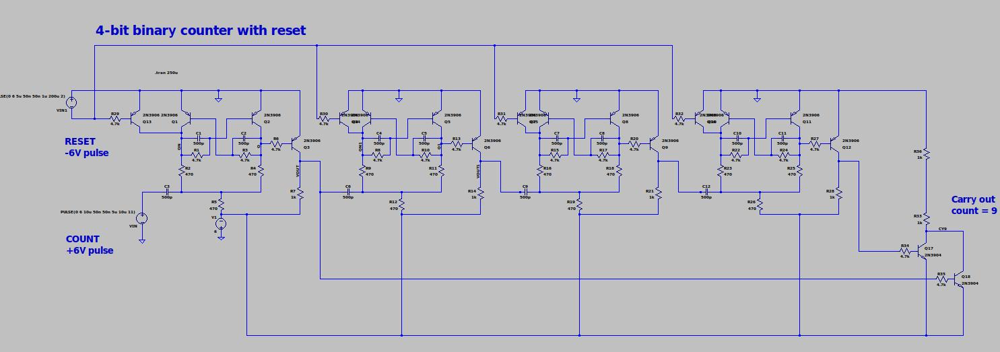

# Incandescent Binary Clock

Crazy idea for a binary clock using small incandescent bulbs

Bulb count (20):

* (2) 10 Hours:  0-2      * *
* (4) 1 Hours    0-9  * * * *
* (3) 10 minutes 0-5    * * *
* (4) 1 minutes  0-9  * * * *
* (3) 10 seconds 0-5    * * *
* (4) 1 seconds  0-9  * * * *

To make it more interesting, let's build all the logic
out of discrete NPN and PNP transistors!

There's a schematic of a working 4-bit binary counter
with count=9 carry output and reset in `Spice/couter-4bit.asc`
(LTspice XVII format).

It requires "only" 18 transistors, 30 resistors, 12 capacitors.
So something like 150, 250, 100 total.

Maybe to make it reasonable to build make a counter "module"
PCB with two stages of 4-bit + 3-bit counter with jumper
options for divide-by 60, 12, 24.  Would need 4 of these on
some sort of motherboard.

Currently thinking to derive 60Hz from the AC line and provide
a buffered clock at this freq which drives all the other counters.

The spice version above is an example... would need to add an
enable input and the different divide-by options.

The 4-bit block requires about 40mA at -6V, so ~ 350mA for logic.
not counting the bulbs.  We could use e.g. 6.3V 150mA bulbs,
wit a total of 20 so ~3A if all bulbs lit.  So we need maybe
a -6V @ 5A total.

    0   0 0 0 0 0    0 0 0 0  0 0
    1   0 0 0 0 1    0 0 0 1  0 0
    2   0 0 0 1 0	 0 0 1 0  0 0
    3   0 0 0 1 1	 0 0 1 1  0 0
    4   0 0 1 0 0	 0 1 0 0  0 0
    5   0 0 1 0 1	 0 1 0 1  0 0
    6   0 0 1 1 0	 0 1 1 0  0 0
    7   0 0 1 1 1	 0 1 1 1  0 0
    8   0 1 0 0 0	 1 0 0 0  0 0
    9   0 1 0 0 1	 1 0 0 1  0 0
    
    10  0 1 0 1 0    0 0 0 0  0 1
    11  0 1 0 1 1    0 0 0 1  0 1
    12  0 1 1 0 0    0 0 1 0  0 1
    13  0 1 1 0 1    0 0 1 1  0 1
    14  0 1 1 1 0    0 1 0 0  0 1
    15  0 1 1 1 1    0 1 0 1  0 1
    16  1 0 0 0 0    0 1 1 0  0 1
    17  1 0 0 0 1    0 1 1 1  0 1
    18  1 0 0 1 0    1 0 0 0  0 1
    19  1 0 0 1 1    1 0 0 1  0 1
    
    20  1 0 1 0 0    0 0 0 0  1 0
    21  1 0 1 0 1    0 0 0 1  1 0
    22  1 0 1 1 0    0 0 1 0  1 0
    23  1 0 1 1 1    0 0 1 1  1 0
    
    24  1 1 0 0 0    0 1 0 0  1 0

